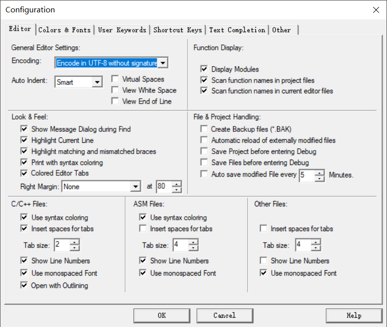

# Lib-code

嵌入式-编码转换


## 目录

- [Lib-code](#lib-code)
- [目录](#目录)
- [快速入门](#快速入门)
  - [下载](#下载)
  - [Keil 设置](#keil-设置)
- [参考资料](#参考资料)
- [项目进展](#项目进展)
- [维护者](#维护者)
- [许可证](#许可证)

## 快速入门

### 下载

 ```git
 git clone https://github.com/ChenxuanZhao/lib-code.git
 ```

### 目录说明

 ``` bash
├─Core       // 源码
│  ├─Inc     // 头文件
│  ├─Lib     // LIB 库
│  └─Src     // 源代码
├─Demo       // 例程
└─Lib-creat  // Lib 库创建
 ```

### Keil 工程设置

> Encoding: Encode in UTF-8 without signature



## [参考资料](https://baike.baidu.com/item/Unicode)

### UTF-8

 > UTF-8以字节为单位对Unicode进行编码。从Unicode到UTF-8的编码方式如下

| Unicode编码 (hex) | UTF-8 字节流 (bin))                 |
|-------------------|-------------------------------------|
| 000000 - 00007F   | 0xxxxxxx                            |
| 000080 - 0007FF   | 110xxxxx 10xxxxxx                   |
| 000800 - 00FFFF   | 1110xxxx 10xxxxxx 10xxxxxx          |
| 010000 - 10FFFF   | 11110xxx 10xxxxxx 10xxxxxx 10xxxxxx |

## 项目进展

### 单字符

- [x]  UTF-8 -> UCS2
- [x]  UCS2  -> UTF-8

### 字符串

- [x]  UTF-8 -> UCS2 编码
- [x]  UCS2 编码 -> UTF-8

## 维护者

 [Chenxuan Zhao](https://github.com/ChenxuanZhao)

## 许可证

 [Apache License](LICENSE)  
 Copyright (c) 2020 Kiyotaka
