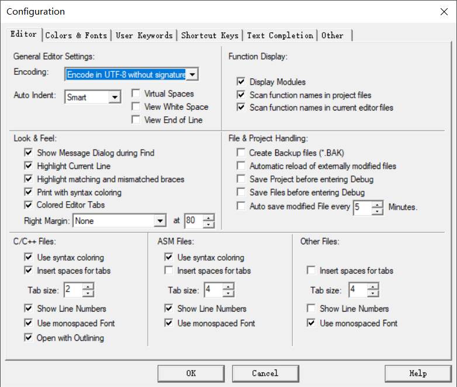
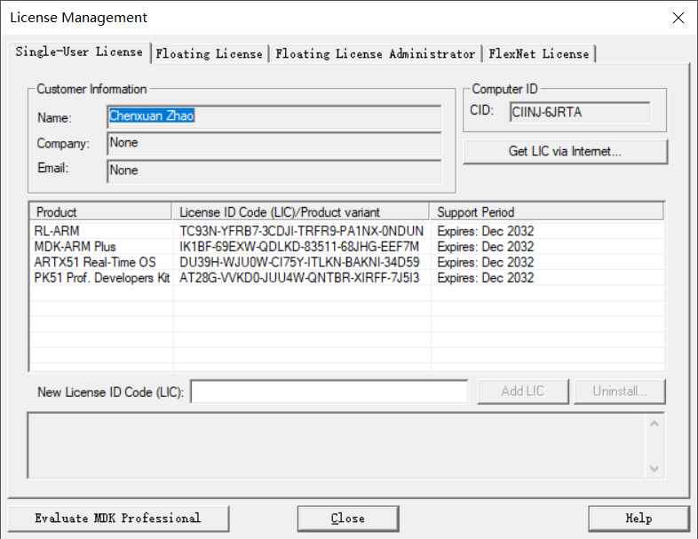

# 冰箱异常报警装置

## 目录

- [冰箱异常报警装置](#冰箱异常报警装置)
- [目录](#目录)
- [快速入门](#快速入门)
  - [目录说明](#目录说明)
  - [Keil 开发环境](#Keil-开发环境)
  - [Keil 设置](#Keil-设置)
  - [添加中间件](#添加中间件)
- [功能介绍](#功能介绍)
  - [常规报警](#常规报警)
  - [查询](#查询)
  - [阈值设置](#阈值设置)
  - [更换手机号](#更换手机号)
  - [开关短信报警](#开关短信报警)

## 快速入门

### 目录说明

 ``` bash
$ tree
.
├── clean.bat  // 清理临时文件
├── Core       // 源码
│   ├── Inc
│   │   ├── main.h
│   │   ├── STC15F2K60S2.H
│   │   ├── stdbool.h
│   │   ├── stdint.h
│   │   └── usart.h
│   └── Src
│       ├── main.c
│       └── usart.c
├── Hardware   // 硬件驱动程序
│   ├── DHT22  // DHT22 驱动程序
│   │   ├── doc
│   │   │   └── DHT22数字温湿度传感器AM2302温湿度.pdf
│   │   ├── Inc
│   │   │   └── DHT22.h
│   │   └── Src
│   │       └── DHT22.c
│   └── SIM900A  // GSM 驱动程序
│       ├── doc
│       │   ├── 1. AT指令集
│       │   ├── 2. 彩信资料
│       │   ├── 3. 程序
│       │   ├── 4. 调试工具
│       │   ├── 5. 常见功能，常用资料汇总
│       │   ├── 6. 调试教程 必看资料
│       │   └── 7. 原理图
│       ├── Inc
│       │   └── GSM.h
│       └── Src
│           └── GSM.c
├── Markdown
│   ├── html
│   ├── KeilSet1.png
│   └── KeilSet2.png
├── MDK-ARM     // Keil 工程文件
│   ├── Conf_tny.A51
│   ├── Listings
│   │   └── Project.m51
│   ├── Objects
│   │   ├── Project
│   │   └── Project.hex
│   ├── Project.uvgui.Chenxuan
│   ├── Project.uvopt
│   ├── Project.uvproj
│   └── STARTUP.A51
├── Middlewares  // 中间件
│   └── lib-code
│       ├── Core
│       │   ├── Inc
│       │   │   ├── lib_code.h
│       │   │   └── stdint.h
│       │   ├── Lib
│       │   │   └── lib-code.LIB
│       │   └── Src
│       │       └── lib_code.c
│       ├── Demo
│       │   ├── Demo.uvproj
│       │   ├── main.c
│       │   └── STARTUP.A51
│       ├── Lib-creat
│       │   └── lib-code.uvproj
│       ├── LICENSE
│       ├── Markdown
│       │   ├── KeilSet.png
│       │   └── logo.png
│       └── README.md
└── README.md

40 directories, 98 files
 ```

 [更多](Markdown/html/files.html)

### Keil 开发环境

``` Info
IDE-Version:
μVision V5.29.0.0
Copyright (C) 2019 ARM Ltd and ARM Germany GmbH. All rights reserved.

License Information:
Chenxuan Zhao
None
LIC=AT28G-VVKD0-JUU4W-QNTBR-XIRFF-7J5I3

Tool Version Numbers:
Toolchain:         PK51 Prof. Developers Kit  Version: 9.60.0.0
Toolchain Path:    D:\Program Files\Arm\Keil_v5\C51\BIN
C Compiler:        C51.exe              V9.60.0.0
Assembler:         A51.exe              V8.2.7.0
Linker/Locator:    BL51.exe             V6.22.2.0
Librarian:         LIB51.exe            V4.30.1.0
Hex Converter:     OH51.exe             V2.7.0.0
CPU DLL:           S8051.DLL            V3.122.0.0
Dialog DLL:        TP51.DLL             V2.60.0.0
Target DLL:        STCMON51.DLL         V1, 0, 10, 0
Dialog DLL:        TP51.DLL             V2.60.0.0
```

### Keil 工程设置

> Encoding: Encode in UTF-8 without signature



> Add License: ARTX51 Real-Time OS



### 添加中间件

#### lib-code

用于 GSM 模块收发中文短信时编码和解码。
[更多](Middlewares/lib-code/README.html)

## 功能介绍

### 常规报警

温度超过阈值

``` SMS
警报: 温度过高!
```

冰箱供电异常

``` SMS
警报: 供电异常!
```

### 查询

手机发送: `查询`
模块返回:

``` SMS
传感器:
状态: 连接正常
温度: 25.2℃
湿度: 65.8%RH

电源:
状态: 供电正常

设置:
阈值:   30℃
```

### 阈值设置

手机发送: `阈值设置：12`
模块返回:

成功:

``` SMS
提示: 阈值设置成功!
```

失败:

``` SMS
提示: 阈值设置失败，请检查输入温度阈值是否正确!
```

### 更换手机号

手机发送: `换号：13771731568`
模块返回:

成功:

``` SMS
提示: 换号成功!
```

失败:

``` SMS
提示: 换号失败，请检查输入手机号是否正确!
```

### 开关短信报警

关闭:

手机发送: `关闭短信报警`
模块返回:

``` SMS
提示: 短信报警已关闭!
```

开启:

手机发送: `开启短信报警`
模块返回:

``` SMS
提示: 短信报警已开启!
```
